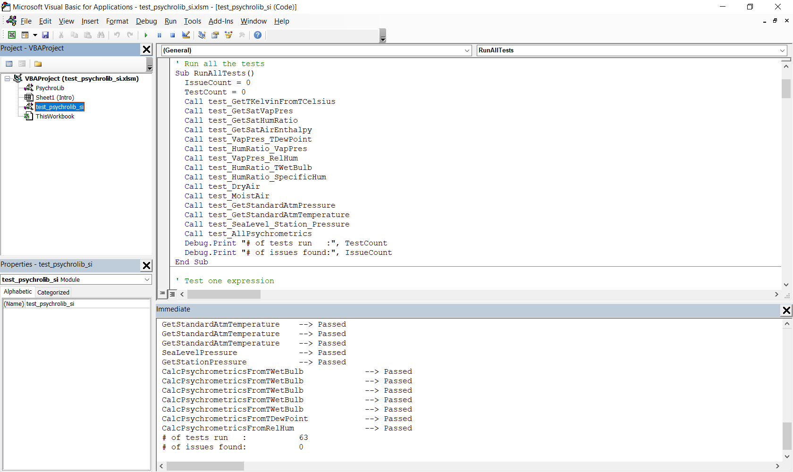

# Development notes

## Coding conventions

The followings are minimal guidelines for new contributors aiming to contribute to the source code. To become acquainted with the conventions it may be easier to first read some of the functions already implemented in the language you are interested to contribute to.

- Always use the language-specific syntax except when defining function names where camel case (e.g. `GetTRankineFromTFahrenheit`) is used irrespective of the language.
- Include a clear description of the function, its inputs, outputs and types.
- Include references.
- Write clear and comprehensive tests.


## Versioning

This project uses [semantic versioning](https://semver.org/).


## Default branches

We use two branches to record the history of the project. The `master` branch stores the official release history while the `develop` branch serves as an integration branch for features and bug fixes. All new releases are tagged with a version number in `master`.

## Deployment

### Python 

From the command prompt, navigate to `src/python`. Then you can create and upload a new release with the following commands:

```
python3 setup.py sdist --formats=zip
python3 -m pip install --user --upgrade twine
python3 -m twine upload dist/*
```

### R

Fist to create the PsychroLib R package, navigate to `src/r` and type `build_package.sh` (assuming you are on Linux, have `R` in your PATH and have the `devtools` installed).

Then, to upload the package on CRAN TODO:

## Testing

PsychroLib is automatically tested at each commit using continuous integration. If are looking to run the tests locally, make sure you can satisfy the required prerequisites and dependencies.

### Prerequisites

- A C and Fortran compiler
- Python version 3.6 or greater.
- Node.js 10.x or greater
- Microsoft Excel
- Microsoft .NET Core SDK


### Dependencies

There are a number of dependencies required to run the tests that need to be installed first. From you command prompt, navigate to the `psychrolib` folder and type the following (I assume that pip and python are for version 3.6 or greater):

```
pip install numpy m2r cffi pytest
cd tests/js && npm install
cd ../..
```


### Run

To run the tests, type the following in your command prompt:


#### Python, C, Fortran
```
python -m pytest -v -s
```


#### JavaScript
```
cd tests/js && npm test
```


#### Microsoft .NET (C#, Visual Basic, and F#)

```
cd src/c_sharp && dotnet test # `dotnet-sdk.dotnet test` if installed with Snapcraft.
```

#### VBA/Excel
For VBA/Excel, navigate to `tests/vba` and open `test_psychrolib_ip.xlsm` and `test_psychrolib_si.xlsm`. For each file, enable macros and launch the Visual Basic Editor (VBE) (Alt+F11 on Windows). Go to `Edit` and activate the 'Immediate Window' (Alt+F11 on Windows) and click on 'RunAllTests' from the right hand side drop down menu at the top next to '(General)'.   But in essence go in the VBA editor, click on RunAllTests, then press on the Run icon or go to 'Run' > 'Run' menu. The results will appear in the 'Immediate Window' at the bottom of the screen.



